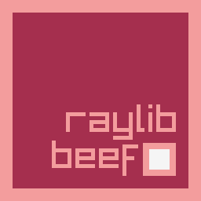

# raylib-beef



BeefLang bindings for **Raylib 5.5**.

## Example
```cs
using System;
using RaylibBeef;
using static RaylibBeef.Raylib;

namespace example;

class Program
{
	public static int Main(String[] args)
	{
		InitWindow(800, 600, scope $"Raylib Beef {RAYLIB_VERSION_MAJOR}.{RAYLIB_VERSION_MINOR}.{RAYLIB_VERSION_PATCH}");
		InitAudioDevice();

		let beefMain = Color(165, 47, 78, 255);
		let beefOutline = Color(243, 157, 157, 255);

		while (!WindowShouldClose())
		{
			BeginDrawing();
			
			ClearBackground(RAYWHITE);

			DrawRectangle(GetScreenWidth() / 2 - 128, GetScreenHeight() / 2 - 128, 256, 256, beefOutline);
			DrawRectangle(GetScreenWidth() / 2 - 112, GetScreenHeight() / 2 - 112, 224, 224, beefMain);

			DrawText("raylib", GetScreenWidth() / 2 - 44, GetScreenHeight() / 2, 50, beefOutline);
			DrawText("beef", GetScreenWidth() / 2 - 62, GetScreenHeight() / 2 + 46, 50, beefOutline);

			DrawRectangle(GetScreenWidth() / 2 + 54, GetScreenHeight() / 2 + 54, 42, 42, beefOutline);
			DrawRectangle(GetScreenWidth() / 2 + 62, GetScreenHeight() / 2 + 62, 26, 26, RAYWHITE);

			DrawCircle(GetMouseX(), GetMouseY(), 20, beefOutline);
			DrawCircle(GetMouseX(), GetMouseY(), 8, beefMain);

			DrawFPS(20, 20);

			EndDrawing();
		}

		CloseAudioDevice();
		CloseWindow();

		return 0;
	}
}
```

## Quick Start (using Beef IDE)
1. Clone this repository to wherever you want
2. Right-click on your workspace and select *Add Existing Project* and select the folder where the *BeefProj.toml* file is.
   


3. Add raylib-beef as a dependency of your project


## Static Linking
On Windows, default linking is set to dynamically link to raylib. This is because of some weird linking problems with MSVC. You can change that by selecting a different project configuration for raylib-beef in the **Workspace** settings. You can select from **StaticDebug** and **StaticRelease**.


## How to Enable OpenGL 4.3 Support
To make use of modern OpenGL features such as compute shaders and Shader Storage Buffer Objects, raylib needs to be compiled with the `RAYLIB_OPENGL_43` flag enabled.
By default, this flag is disabled and any attempt to use OpenGL 4.3 features will result in runtime errors that look like this:
```
WARNING: SHADER: Compute shaders not enabled. Define GRAPHICS_API_OPENGL_43
WARNING: SSBO: SSBO not enabled. Define GRAPHICS_API_OPENGL_43
```

raylib-beef provides binaries that have been compiled with the `RAYLIB_OPENGL_43` flag enabled. To use these binaries, head to your Workspace properties and choose any of the `*_GL43` build configurations under `Targeted` > `Projects` > `raylib-beef`:


Note that OpenGL 4.3 support is currently only available for Windows.

## More Links
* Raylib Repo (https://github.com/raysan5/raylib)
* BeefLang (https://www.beeflang.org)

## Contribution
I'll be happy to resolve any issues or pull requests.
